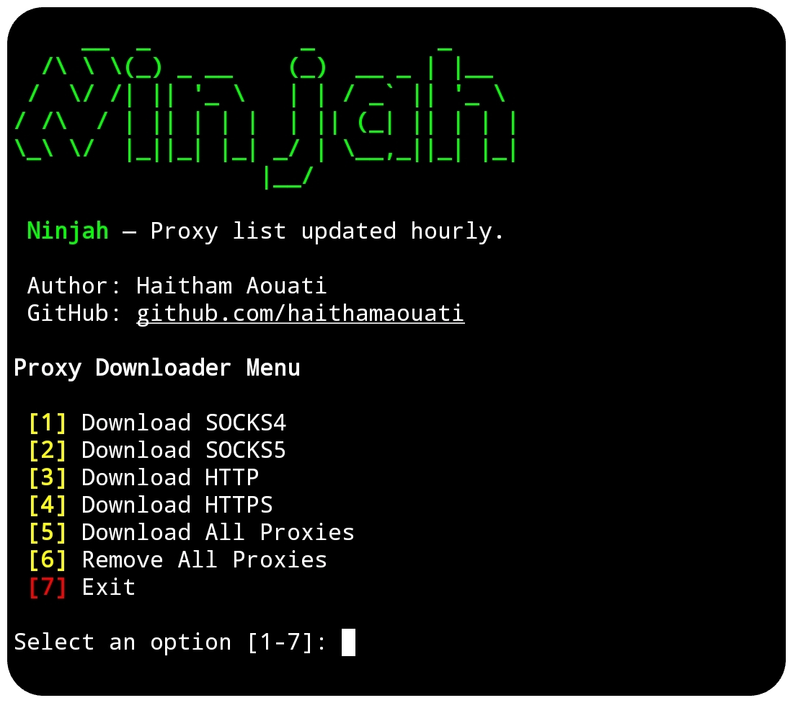

# Ninjah

**Ninjah** delivers fresh public proxies—auto-updated hourly.



## Install

To use the Ninjah script, follow these steps:

1. Clone the repository:

    ```
    git clone https://github.com/haithamaouati/Ninjah.git
    ```

2. Change to the Ninjah directory:

    ```
    cd Ninjah
    ```
    
3. Change the file modes
    ```
    chmod +x ninjah.sh
    ```
    
5. Run the script:

    ```
    ./ninjah.sh
    ```

## Usage

Usage: `./ninjah.sh`

##### Options:

Options | Actions
--- | ---
1 | Download SOCKS4
2 | Download SOCKS5
3 | Download HTTP
4 | Download HTTPS
5 | Download All Proxies
6 | Remove All Proxies
7 | Exit

## Dependencies

The script requires the following dependencies:

- **curl**: `pkg install curl - y`

Make sure to install these dependencies before running the script.

## Environment

- Tested on [Termux]()

## Disclaimer
> [!WARNING]
> We are not responsible for any misuse or damage caused by this program. use this tool at your own risk!

## License

Ninjah is licensed under [WTFPL license](LICENSE).
